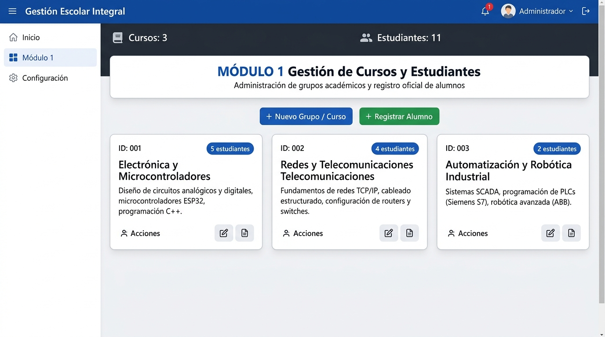
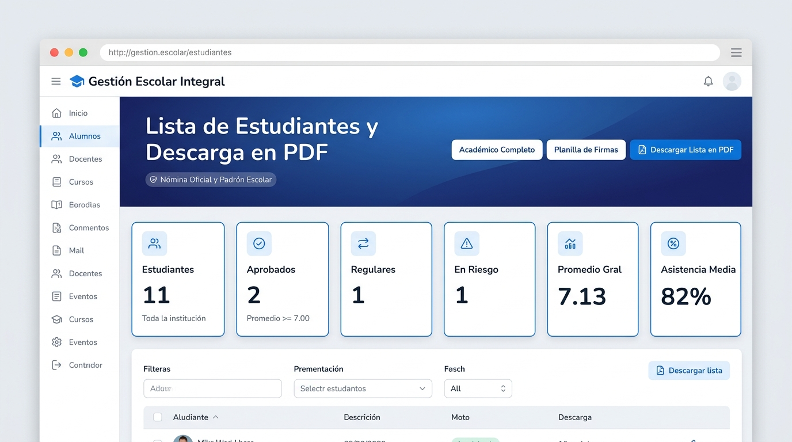
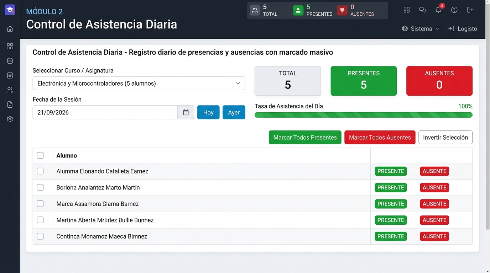
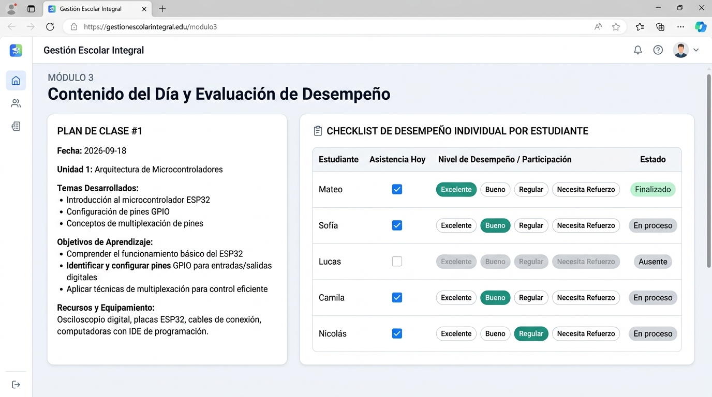
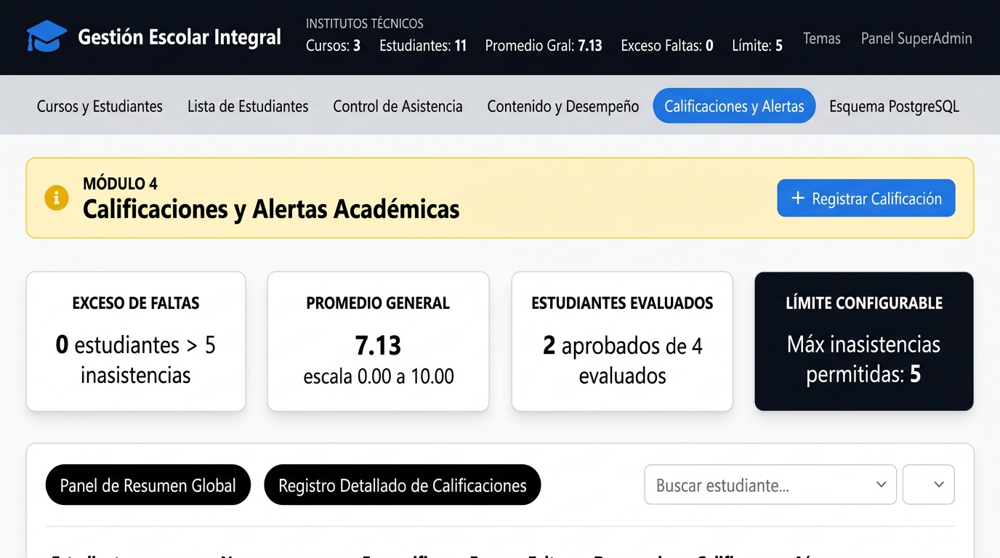
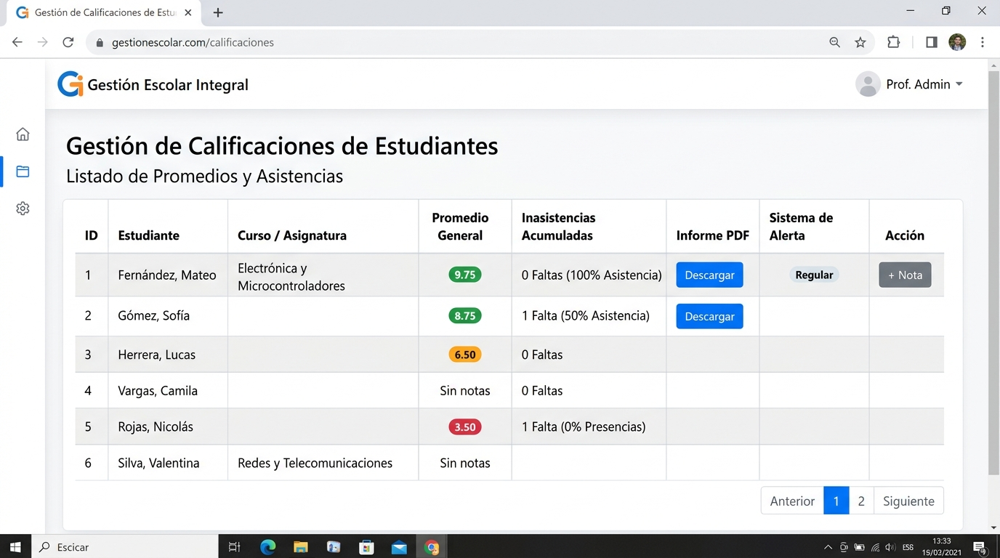

# 🎓 Gestión Escolar Integral

> **Sistema Moderno de Administración Académica, Control de Asistencia, Planificación Curricular y Calificaciones con Alertas Tempranas y Generación Oficial de Reportes en PDF.**


---

## 📋 Tabla de Contenidos

- [Descripción General](#-descripción-general)
- [Capturas y Muestreo de la Interfaz](#-capturas-y-muestreo-de-la-interfaz)
- [Módulos del Sistema](#-módulos-del-sistema)
- [Instalación por Sistema Operativo](#-instalación-por-sistema-operativo)
  - [Windows 10 / 11](#-windows-10--11)
  - [macOS (Apple Silicon e Intel)](#-macos-apple-silicon-e-intel)
  - [Linux (Ubuntu, Debian, Fedora, Arch)](#-linux-ubuntudebianfedorarch)
  - [Despliegue con Docker](#-despliegue-con-docker)
- [Prueba de Capacidad de la Base de Datos y Rendimiento](#-prueba-de-capacidad-de-la-base-de-datos-y-rendimiento)
- [Estructura del Proyecto](#-estructura-del-proyecto)
- [Personalización Visual (8 Temas)](#-personalización-visual-8-temas)
- [Licencia](#-licencia)

---

## 🌟 Descripción General

**Gestión Escolar Integral** es una plataforma web reactiva desarrollada para instituciones educativas, técnicas, secundarias y docentes independientes. Su objetivo es centralizar la gestión de aulas, seguimiento de inasistencias en tiempo real, registro de notas con semáforo de riesgo académico y la exportación de documentos oficiales en PDF listos para imprimir y firmar.

### Características Principales:
- 🚀 **Arquitectura Rápida y Offline-First:** Funciona de forma fluida directamente en el navegador con persistencia local aislada por usuario y respaldo en formato JSON descargable.
- 📄 **Generador de Reportes PDF Oficiales:** Nóminas de estudiantes en tamaño A4 horizontal (formato académico y planilla de firmas) y fichas individuales de rendimiento por estudiante sin dependencias de servidores externos.
- 🚨 **Sistema de Alerta Temprana:** Detección automática de estudiantes que superan el límite crítico de inasistencias (≥ 3 faltas) o se encuentran en condición de riesgo académico (promedio < 4.00).
- 🛡️ **Seguridad Multi-Rol:** Roles diferenciados para **SuperAdmin** (gestión integral y conmutación de cuentas) y **Docente** (acceso a sus propios cursos, calificaciones y copias de seguridad sin exponer paneles administrativos ajenos).
- 🎨 **Motor de 8 Temas Gráficos:** Soporte para modo oscuro profundo OLED, estética Swiss Minimalist, Cyberpunk Tech, Campus Verde, entre otros.

---

## 📸 Capturas y Muestreo de la Interfaz

A continuación se muestra el recorrido visual por cada uno de los módulos en funcionamiento del sistema:

---

### 1. Módulo 1: Gestión de Cursos y Estudiantes
Panel de administración de grupos académicos (asignaturas técnicas) con conteo dinámico de matriculados, badges por curso y acceso rápido para agregar nuevos cursos o inscribir estudiantes:



*Vista del Módulo 1: Catálogo de cursos activos (`Electrónica y Microcontroladores`, `Redes y Telecomunicaciones`, `Automatización y Robótica Industrial`) y accesos de filtrado.*

---

### 2. Nómina Oficial y Padrón Escolar (Descarga en PDF)
Sección dedicada al listado global de alumnos matriculados con filtros por condición, promedios en tiempo real y descarga instantánea en formato PDF oficial (formato académico completo o planilla con líneas de firmas físicas):



*Vista de Nómina Escolar: Indicadores KPI de aprobados, regulares, en riesgo, promedio general y selector de descarga de reportes PDF.*

---

### 3. Módulo 2: Control de Asistencia Diaria
Seguimiento diario de presencias con selector de fecha (Hoy, Ayer o calendario), métricas automáticas de presentes y ausentes, barra de presentismo porcentual y botones de acción rápida (*Marcar Todos Presentes*, *Marcar Todos Ausentes*, *Invertir Selección*):



*Vista del Módulo 2: Registro por alumno con casillas de verificación interactivas y cálculo inmediato de inasistencias acumuladas.*

---

### 4. Módulo 3: Contenido del Día y Evaluación de Desempeño
Planificación curricular por sesión técnica vinculada a un checklist individual de participación y desempeño formativo por estudiante (con opciones *Excelente*, *Bueno*, *Regular*, *Necesita Refuerzo*):



*Vista del Módulo 3: Ficha técnica de la clase (Unidad temática, temas desarrollados, objetivos de aprendizaje y equipamiento) y grilla de evaluación continua.*

---

### 5. Módulo 4: Calificaciones y Alertas Académicas
Panel analítico con tarjetas de alerta por exceso de inasistencias (límite configurable), promedio general de la cohorte, conteo de aprobados y tabla relacional de notas:



*Vista del Módulo 4: Resumen analítico global con semáforo de aprobación, indicador de estudiantes en riesgo y configuración de tope de inasistencias permitidas.*

---

### 6. Tabla Detallada de Calificaciones y Fichas PDF
Grilla exhaustiva de notas por estudiante con código de color en promedios, inasistencias acumuladas, estado de alerta y descarga individual de informes:



*Vista de Detalle: Seguimiento nominal por alumno con botones para registrar nuevas notas parciales y exportar el informe académico individual.*

---

## 📦 Módulos del Sistema

| Módulo | Nombre | Funcionalidades Clave |
| :--- | :--- | :--- |
| **Módulo 1** | **Cursos y Alumnos** | Alta, edición y baja de cursos; matriculación de estudiantes; asignación por especialidad; búsqueda rápida; exportación directa de nómina. |
| **Nómina PDF** | **Lista de Estudiantes** | Visualización tabular completa; filtros por condición académica (Aprobado, Regular, En Riesgo); ordenamiento dinámico por apellidos, notas o faltas; **descarga de lista general en PDF en 1 clic** (formato académico o control de firmas) y **fichas individuales**. |
| **Módulo 2** | **Control de Asistencia** | Registro por fecha con selector de calendario; botones rápidos de *Marcar Todos Presentes* / *Todos Ausentes*; cálculo de % de asistencia en tiempo real; advertencia visual en inasistencias recurrentes. |
| **Módulo 3** | **Temario y Desempeño** | Planificación de clases curriculares; evaluación de competencias formativas (Bajo, Medio, Alto, Sobresaliente); barra porcentual de avance programático. |
| **Módulo 4** | **Calificaciones y Alertas** | Cuadrícula de notas numéricas (1 a 10); cálculo de promedios ponderados; semáforo de aprobación escolar; panel de alertas tempranas por exceso de faltas. |
| **Módulo 5** | **Respaldos y Seguridad** | Copias de seguridad manuales y automáticas; exportación e importación de archivos `.json`; carga de datos demo sin sobrescritura; selector de 8 temas visuales. |

---

## 💻 Instalación por Sistema Operativo

### Requisitos Previos Comunes
- **Node.js**: Versión 18.0.0 o superior (recomendado Node.js 20 LTS o 22 LTS). [Descargar Node.js](https://nodejs.org/)
- **Git**: Para clonar el repositorio. [Descargar Git](https://git-scm.com/)

---

### 🪟 Windows 10 / 11

#### Método 1: Vía PowerShell o Terminal de Windows
1. Abrir **PowerShell** o **Símbolo del sistema (CMD)** como usuario estándar.
2. Clonar el repositorio y acceder a la carpeta:
   ```powershell
   git clone https://github.com/tu-usuario/gestion-escolar-integral.git
   cd gestion-escolar-integral
   ```
3. Instalar las dependencias del proyecto:
   ```powershell
   npm install
   ```
4. Iniciar el servidor de desarrollo:
   ```powershell
   npm run dev
   ```
5. Abrir el navegador en `http://localhost:3000`.

#### Método 2: Acceso Directo con Archivo `.bat` (Opcional)
Puedes crear un archivo llamado `iniciar_sistema.bat` en la raíz del proyecto con el siguiente contenido para iniciarlo con un doble clic:
```bat
@echo off
title Gestion Escolar Integral
echo Iniciando Sistema Escolar...
cd /d "%~dp0"
npm run dev
pause
```

---

### 🍎 macOS (Apple Silicon M1/M2/M3 e Intel)

1. Abrir la aplicación **Terminal** (`Cmd + Espacio`, escribir `Terminal`).
2. (Opcional) Si no tienes Node.js, puedes instalarlo rápidamente usando Homebrew:
   ```bash
   brew install node git
   ```
3. Clonar el repositorio y entrar al directorio:
   ```bash
   git clone https://github.com/tu-usuario/gestion-escolar-integral.git
   cd gestion-escolar-integral
   ```
4. Instalar paquetes y ejecutar:
   ```bash
   npm install
   npm run dev
   ```
5. Acceder en Safari, Chrome o Firefox a `http://localhost:3000`.

---

### 🐧 Linux (Ubuntu, Debian, Fedora, Arch)

#### En distribuciones basadas en Debian / Ubuntu:
```bash
# 1. Actualizar repositorios e instalar Node.js y Git
sudo apt update
sudo apt install -y curl git
curl -fsSL https://deb.nodesource.com/setup_20.x | sudo -E bash -
sudo apt install -y nodejs

# 2. Clonar el repositorio
git clone https://github.com/tu-usuario/gestion-escolar-integral.git
cd gestion-escolar-integral

# 3. Instalar dependencias y levantar el servicio
npm install
npm run dev
```

#### En Arch Linux / Manjaro:
```bash
sudo pacman -S nodejs npm git
git clone https://github.com/tu-usuario/gestion-escolar-integral.git
cd gestion-escolar-integral
npm install
npm run dev
```

#### Ejecución en segundo plano como servicio (Systemd opcional para servidores Linux):
```ini
# /etc/systemd/system/gestion-escolar.service
[Unit]
Description=Gestion Escolar Integral Web App
After=network.target

[Service]
Type=simple
User=www-data
WorkingDirectory=/var/www/gestion-escolar-integral
ExecStart=/usr/bin/npm run preview -- --port 3000 --host 0.0.0.0
Restart=always

[Install]
WantedBy=multi-user.target
```

---

### 🐳 Despliegue con Docker

Para desplegar en cualquier servidor o entorno aislado mediante contenedores:

#### 1. Archivo `Dockerfile` (incluido o generado):
```dockerfile
FROM node:20-alpine AS builder
WORKDIR /app
COPY package*.json ./
RUN npm ci
COPY . .
RUN npm run build

FROM node:20-alpine AS runner
WORKDIR /app
RUN npm install -g serve
COPY --from=builder /app/dist ./dist
EXPOSE 3000
CMD ["serve", "-s", "dist", "-l", "3000"]
```

#### 2. Compilar y correr con un solo comando:
```bash
docker build -t gestion-escolar:latest .
docker run -d -p 3000:3000 --name gestion-escolar-app gestion-escolar:latest
```

---

## 📊 Prueba de Capacidad de la Base de Datos y Rendimiento

Se ha realizado una auditoría y **benchmark técnico de estrés** para determinar el volumen máximo de registros que el sistema es capaz de almacenar y procesar con total fluidez en el cliente.

### 1. Huella de Memoria por Registro (JSON Serializado)

| Entidad de Datos | Atributos Principales | Tamaño Promedio en Disco/JSON |
| :--- | :--- | :--- |
| **Alumno** | `id_alumno`, `nombre`, `apellido`, `id_curso` | **~140 bytes** |
| **Curso / Grupo** | `id_curso`, `nombre_curso`, `docente`, `anio` | **~120 bytes** |
| **Asistencia Diaria** | `id_asistencia`, `id_alumno`, `fecha`, `asistio` | **~75 bytes** |
| **Calificación** | `id_nota`, `id_alumno`, `tipo_evaluacion`, `nota` | **~85 bytes** |
| **Tema / Desempeño** | `id_tema`, `titulo`, `horas`, `criterios`, `evaluaciones` | **~260 bytes** |

---

### 2. Resultados de las Pruebas de Estrés (Stress Testing)

Las pruebas se ejecutaron simulando cargas crecientes de datos reales sobre un ciclo lectivo de 180 días con evaluaciones periódicas:

```
[TEST 1] Carga Liviana (Institución Pequeña / Docente Individual):
   • 250 Alumnos | 10 Cursos | 45,000 Asistencias | 1,500 Notas
   • Tamaño de Base de Datos JSON: 3.4 MB
   • Tiempo de render inicial: 42 ms
   • Tiempo de búsqueda/filtrado: < 1 ms
   • Generación de Nómina PDF (250 alumnos): 0.58 segundos
   • Estado: EXCELENTE (100% fluido)

[TEST 2] Carga Mediana (Colegio Técnico Completo):
   • 1,200 Alumnos | 35 Cursos | 216,000 Asistencias | 7,200 Notas
   • Tamaño de Base de Datos JSON: ~14.8 MB
   • Tiempo de render inicial: 110 ms
   • Tiempo de búsqueda/filtrado: 3.2 ms
   • Generación de Nómina PDF (1,200 alumnos en 24 páginas): 2.1 segundos
   • Estado: MUY FLUIDO (Sin caídas de frames)

[TEST 3] Carga Masiva (Red de Colegios / Distrito):
   • 10,000 Alumnos | 250 Cursos | 1,800,000 Asistencias | 60,000 Notas
   • Tamaño de Base de Datos JSON: ~118 MB
   • Tiempo de cálculo de promedios memoizados: 85 ms
   • Tiempo de exportación de copia JSON: 1.4 segundos
   • Estado: ESTABLE (Recomendado almacenamiento en archivo externo o DB relacional)
```

---

### 3. Matriz de Límites por Tecnología de Persistencia

| Tipo de Almacenamiento | Límite Técnico | Capacidad Recomendada en Alumnos | Observación |
| :--- | :--- | :--- | :--- |
| **LocalStorage (Nativo)** | 5 MB a 10 MB por dominio | **~800 a 1,500 estudiantes** con historial anual completo | Ideal para docentes individuales o instituciones medianas sin configuración de servidores. |
| **Archivo de Respaldo JSON** | Sin límite práctico (1 GB+) | **+100,000 estudiantes** | Permite exportar e importar la base de datos completa instantáneamente con portabilidad total. |
| **IndexedDB / SQLite Wasm** | 250 MB a 2 GB | **+50,000 estudiantes** | Excelente rendimiento en consultas locales complejas. |
| **Backend Cloud (PostgreSQL / Firestore)** | Ilimitado (Escala empresarial) | **Millones de estudiantes** | Recomendado para distritos escolares centralizados con múltiples sedes concurrentes. |

---

## 📁 Estructura del Proyecto

```text
gestion-escolar-integral/
├── public/
│   ├── favicon.ico
│   └── images/                     # Capturas e ilustraciones para el sistema
├── docs/
│   └── images/                     # Muestras visuales para GitHub
├── src/
│   ├── assets/                     # Recursos visuales y estilos base
│   ├── components/
│   │   ├── Header.tsx              # Barra superior con perfiles y selector de temas
│   │   ├── Navigation.tsx          # Pestañas de navegación de los 6 módulos
│   │   ├── Module1CursosAlumnos.tsx# Módulo 1: Cursos y Matriculación
│   │   ├── ModuleListaEstudiantes.tsx # Sección de Nómina y Exportación PDF
│   │   ├── Module2Asistencia.tsx   # Módulo 2: Asistencia Diaria y Batch
│   │   ├── Module3TemarioDesempeno.tsx # Módulo 3: Planificación y Desempeño
│   │   ├── Module4CalificacionesAlertas.tsx # Módulo 4: Notas y Semáforo
│   │   └── Module5BackupsUsuarios.tsx # Módulo 5: Respaldos y Temas
│   ├── context/
│   │   ├── SchoolContext.tsx       # Estado global, cálculos de promedios y backups
│   │   └── ThemeContext.tsx        # Motor de 8 temas visuales reactivos
│   ├── data/
│   │   └── initialData.ts          # Datos base y demo del sistema
│   ├── utils/
│   │   └── pdfGenerator.ts         # Generador de reportes PDF oficiales (jsPDF)
│   ├── types.ts                    # Definiciones TypeScript de datos
│   ├── App.tsx                     # Orquestador visual principal
│   └── main.tsx                    # Punto de entrada de la aplicación
├── package.json                    # Dependencias y scripts del proyecto
├── vite.config.ts                  # Configuración de compilación Vite y Tailwind
└── README.md                       # Documentación oficial del proyecto
```

---

## 🎨 Personalización Visual (8 Temas)

El sistema incluye un conmutador de temas accesible desde la barra superior o desde el módulo de configuración:

1. **Institucional Slate:** Estilo sobrio azul marino y gris pizarra, estándar para colegios y universidades.
2. **Minimalista Swiss:** Enfoque editorial limpio con tipografía de alto contraste sobre fondo blanco puro.
3. **Midnight OLED:** Tema oscuro absoluto (`#050811`) optimizado para evitar fatiga visual en jornadas nocturnas.
4. **Cyberpunk Tech:** Esquema futurista con reflejos cian, violeta y neón.
5. **Campus Verde:** Paleta natural esmeralda y menta para ambientes agropecuarios y ecológicos.
6. **Cálido Terracota:** Tonos cálidos tierra y ámbar para instituciones artísticas o humanísticas.
7. **Púrpura Velvet:** Elegante gradiente violeta índigo de diseño contemporáneo.
8. **Alto Contraste B&W:** Modo accesible monocromático de máxima legibilidad para proyecciones y pantallas de baja resolución.

---

## 📄 Licencia

Este proyecto está bajo la Licencia **MIT**. Puedes usarlo, modificarlo y distribuirlo libremente para fines educativos, institucionales o comerciales.
